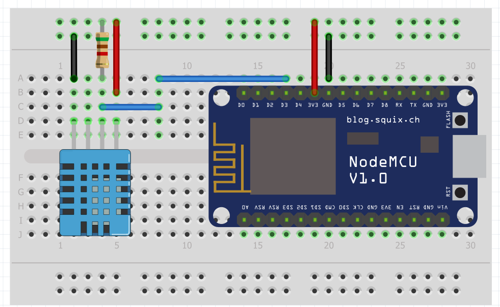
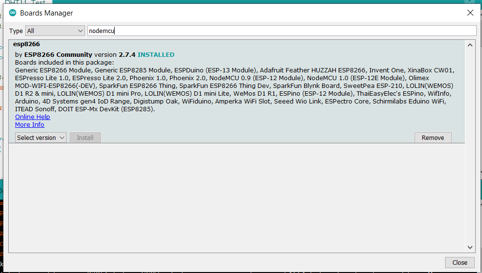
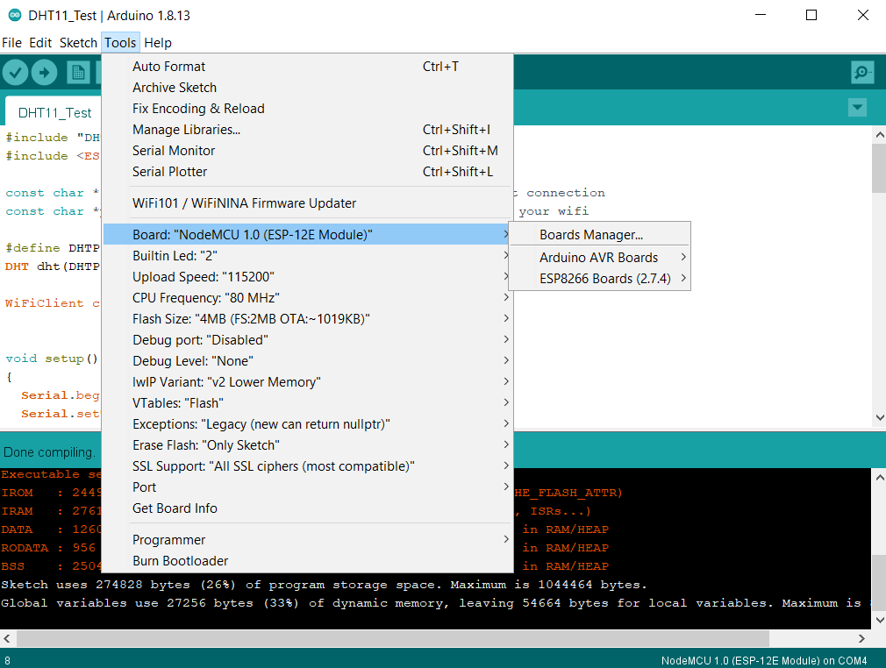
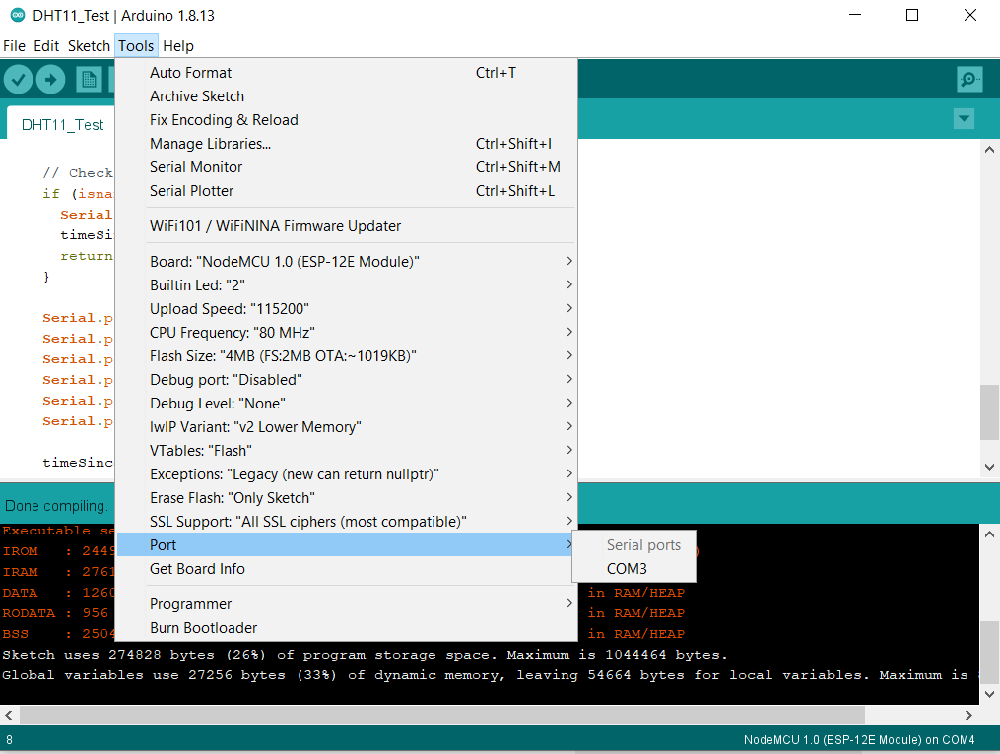
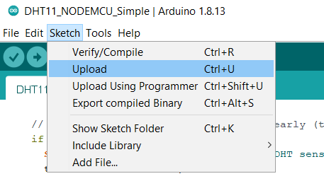

# nodemcu-dht11

## **This is a simple Arduino project based on NodeMCU v1.0 (ESP-12E) board and a DHT11 temperature/humidity sensor.**

### Figure below shows the connection diagram for the circuit.

### 
### **Under Arduino IDE, open the project file "DHT11_NODEMCU_Simple.ino".**
### **Ensure the ESP8266 board library is installed as shown in figure below.**

### **Select the NODEMCU v1.0 board as shown in figure below.**

### **Ensure the correct serial port is select as shown in figure below.**
### **The Serial Monitor (within the same menu) can be activated to observe the temeprature and humidity readings output by the board when the program is running."**

### **Connect the NODEMCU board to your PC's USB port, once you are ready to run your program on the NODEMCU board.**
### **Click on Upload as shown in figure below.**

### 
### 
### **Once the upload is completed, you should be able to observe text output on the Serial Monitor window.**

###
### 
## **In subsequent project, an enhancement will be added to make use of NODERED and MQTT to create a remote sensor monitoring display on web browser.**
### 
## **Stay tuned! Get a preview of the working enhancement at http://dht11.ck-sandbox.cyou**
